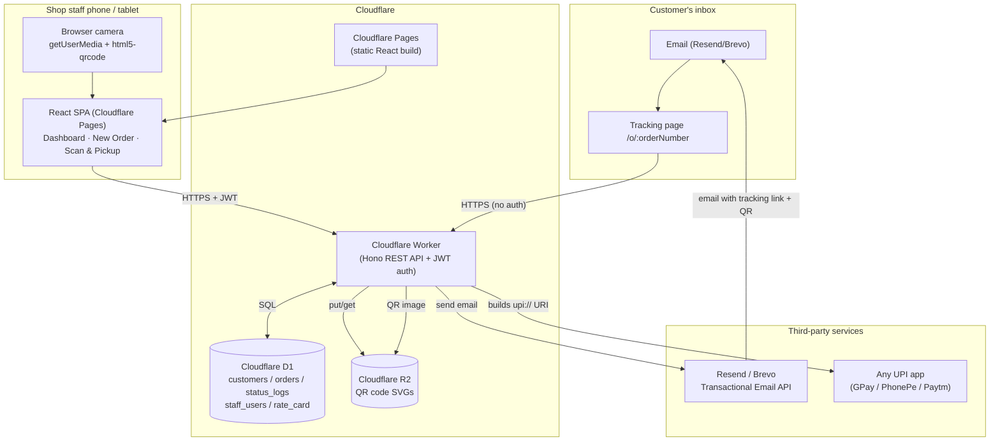

# System Architecture

A single small laundry shop needs almost no server, so the whole app runs on
Cloudflare's edge platform: a static frontend on Pages, a stateless API on
Workers, SQL data in D1, and QR images in R2. There is no origin server to
patch, back up, or pay idle cost for.

## Component responsibilities

**Cloudflare Pages (frontend)** serves the built React SPA: login, dashboard,
new-order flow, camera-based QR scan/pickup flow, and a public,
no-login order-tracking page that the email link and QR both point to. Free
tier: unlimited requests and bandwidth, 500 builds/month.

**Cloudflare Worker (backend)** is a single Hono app exposing the REST API
below. It is stateless - every request re-verifies a JWT and reads/writes D1
directly, so it scales to zero and back with no cold-start cost concerns for
this traffic volume.

**Cloudflare D1** (SQLite at the edge) stores customers (now including
email, the notification channel), orders, per-order status history, staff
logins, the price list, and the yearly order-number counter. Free tier: 5 GB
storage, 5 million rows read/day, 100k rows written/day - vastly more than
one shop needs.

**Cloudflare R2** stores each order's QR code as a small SVG (a few KB), and
the same image is embedded directly in the notification emails. R2 has no
egress fees, so serving it to customers' phones and inlining it in emails
costs nothing extra. Free tier: 10 GB storage, 1M Class A (write) and 10M
Class B (read) operations/month.

**Resend (or Brevo)** sends the four transactional emails:
order received, in progress, ready for pickup, handed over. Email replaced
SMS as the sole communication channel, which also means messages can now
carry the QR image inline and a styled "view status" button instead of a
plain-text link - see `docs/DEPLOYMENT.md` for provider setup and domain
verification. This remains the only per-transaction cost in the system (see
`COST_BREAKDOWN.md`), and it is smaller than SMS at this volume since both
providers' free tiers cover a small shop's monthly email count.

**UPI static/dynamic QR** - no payment gateway, no MDR fees. The Worker just
builds a standard `upi://pay?...` string with the shop's fixed VPA and the
bill amount, and renders it as a QR image the customer scans with any UPI
app. Cloudflare never touches money.

## Request flow: drop-off to handover

1. Staff opens the PWA (Pages), logs in - Worker returns a JWT.
2. **Drop-off**: staff enters the phone number → `GET /customer/find` (phone
   remains the front-desk lookup key). If new, staff fills
   name/email/area/landmark → `POST /customer/create`. Email is required -
   it is now the only channel used for notifications.
3. **Create order**: staff enters item counts + service type →
   `POST /order/create`. The Worker allocates an order number
   (`PN-LND-2026-000123`), renders a QR that encodes the customer tracking
   URL, uploads it to R2, saves everything to D1, and emails the "received"
   template (with the QR embedded) via Resend/Brevo.
4. **Status updates**: as laundry moves through the shop, staff taps
   "Start Processing" / "Mark Ready for Pickup" on the dashboard →
   `POST /order/update-status`, which logs to `status_logs` and sends the
   matching email.
5. **Pickup**: customer shows the QR (from the email or by reopening the
   tracking link on their phone). Staff scans it with the phone/tablet
   camera (`html5-qrcode` + `getUserMedia`) → `GET /order/get-by-qr` loads
   the order. Staff enters/confirms the final amount →
   `POST /payment/generate-upi-qr` returns a UPI QR the customer scans to
   pay.
6. **Handover**: once paid, staff taps "Handover Kara" →
   `POST /order/update-status` with `status=Handed Over`, which sends the
   final thank-you email.

## Why this shape

- **No servers to run** - Workers/Pages/D1/R2 are all managed, autoscaling,
  and billed per-use, which is what keeps a single shop's monthly bill low
  (see `COST_BREAKDOWN.md`).
- **SVG QR codes, not PNG** - the `qrcode` npm package's SVG renderer is pure
  JavaScript and runs directly in the Workers V8 isolate; PNG rendering in
  that package needs the native `canvas` addon, which Workers cannot load.
  SVG also embeds cleanly as an inline `` in HTML email.
- **Email instead of SMS** - no DLT template registration required (a
  mandatory, multi-day process for Indian SMS), messages can be richer
  (inline QR image, a styled button, more room for context), and the
  provider free tiers (Resend: 3,000/month, Brevo: 300/day) comfortably
  cover a small shop's order volume at zero cost. The trade-off is that not
  every customer checks email as promptly as SMS - see `docs/DEPLOYMENT.md`
  for provider setup and deliverability notes (SPF/DKIM domain
  verification).
- **Public tracking page** - the same page customers reach when they open
  the emailed link doubles as the pickup QR display, so there's a single
  source of truth for "what does my order look like right now" beyond the
  inbox.
